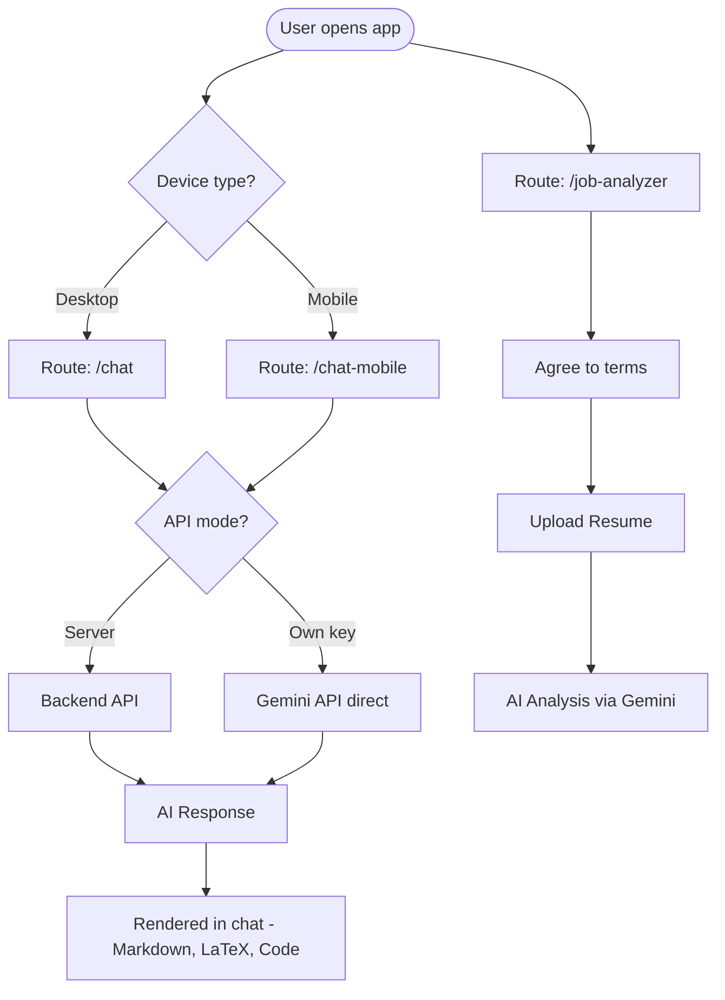

# Anie AI — Frontend

React + TypeScript frontend for **Anie AI** — a chat interface powered by Gemini with a built-in Job Analyzer tool.

---

## How it works



---

## Quick start

```bash
npm install
npm run dev
# → http://localhost:5173
```

Create a `.env` file:

```env
# development
VITE_API_URL=http://localhost:8080/api/chat

# production (nginx reverse proxy)
# VITE_API_URL=/api/chat
```

---

## Features

| Feature | Details |
|---|---|
| Chat | Markdown, LaTeX (KaTeX), code highlighting |
| Responsive | Separate optimised views for desktop & mobile |
| Job Analyzer | Upload resume → AI-powered job fit analysis |
| Own API key | Bring your own Gemini key via Settings |
| Local history | Chat history stored in IndexedDB — never leaves browser |
| PWA | Installable as a progressive web app |

---

## Folder structure

```
src/
├── pages/          # Chat, ChatMobile, Home, Settings
├── components/     # DeviceGuard, MessageContent
├── features/
│   └── job-analyzer/   # Resume upload & analysis flow
└── lib/            # firebase, gemini, db, settings
```

---

## Using your own Gemini API key

1. Open **Settings** (gear icon)
2. Enable "Use my own API key"
3. Paste your key and pick a model
4. Save — chat goes directly to Gemini

---

## License

GPL-3.0
