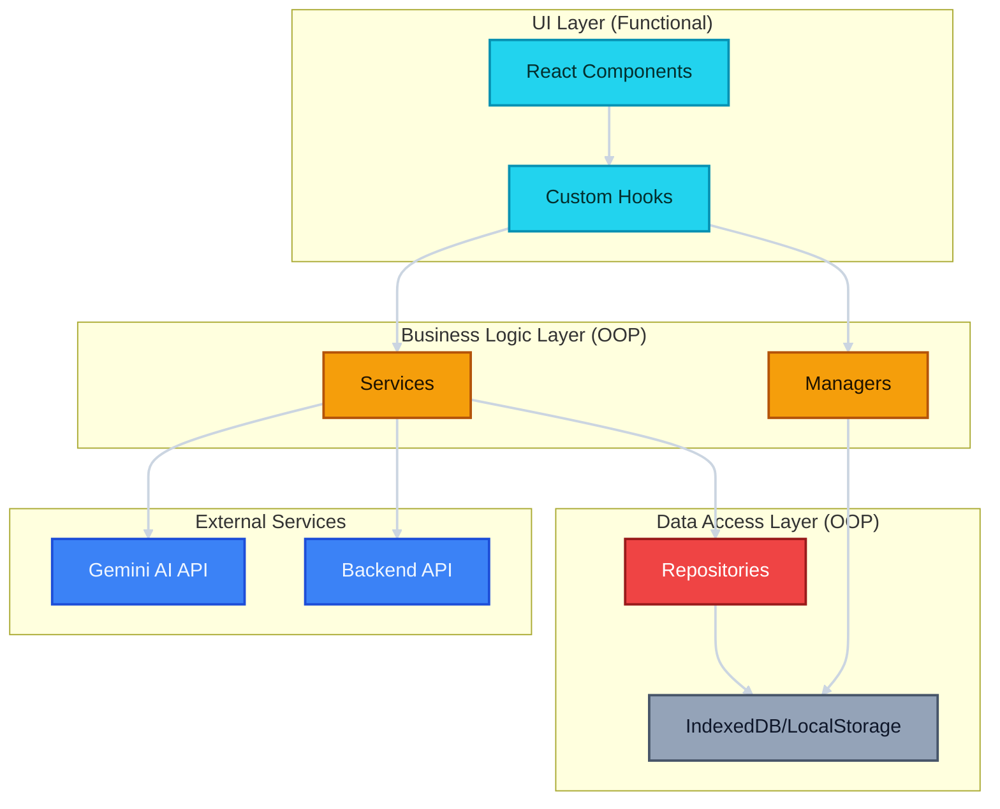
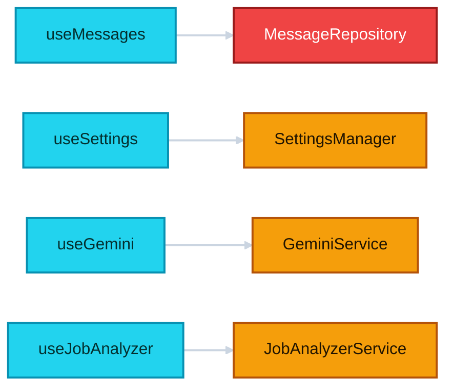
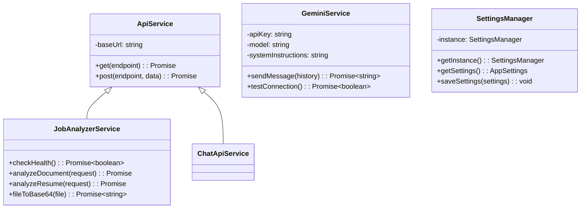
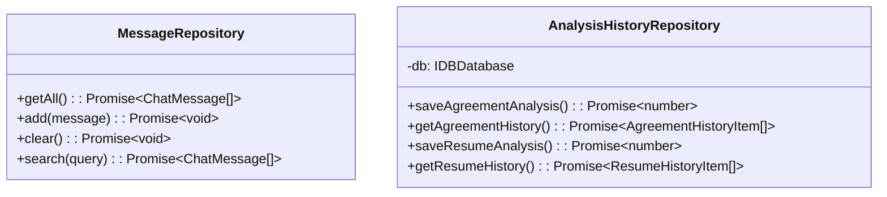
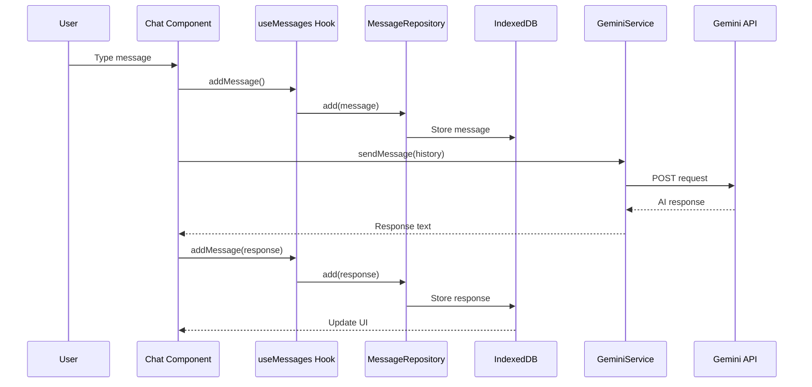
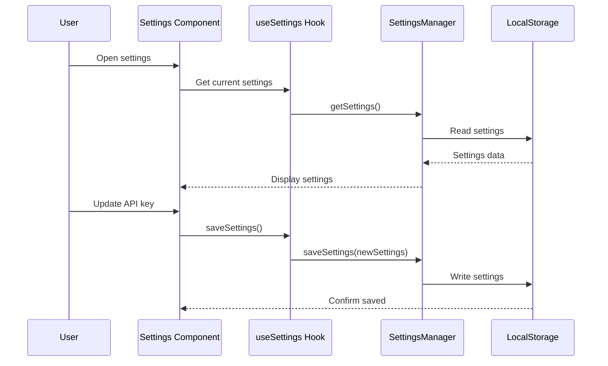
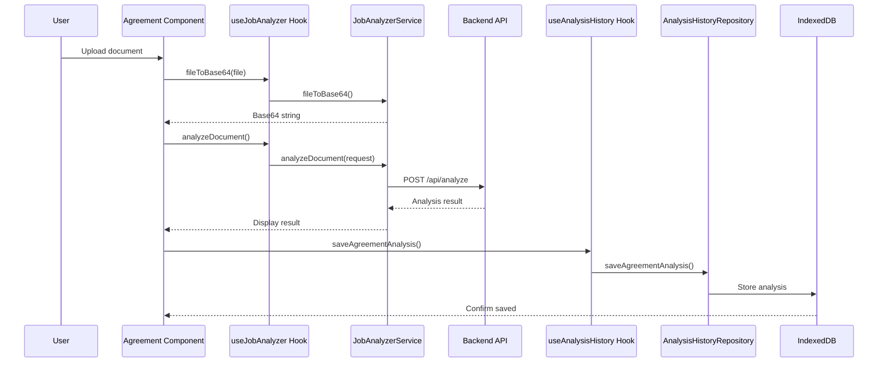

# Architecture Overview

This document explains the architecture of the Anie AI application, which follows a modern hybrid approach combining functional React components with OOP services.

## Table of Contents

- [Architecture Pattern](#architecture-pattern)
- [Layer Breakdown](#layer-breakdown)
- [Data Flow](#data-flow)
- [Design Principles](#design-principles)

## Architecture Pattern

We use a **Hybrid Architecture** that combines:
- **Functional Programming** for UI components (React hooks)
- **Object-Oriented Programming** for services and data access



## Layer Breakdown

### 1. UI Layer (Functional)

**Components**: React functional components with hooks
- `Chat.tsx` - Main chat interface
- `Settings.tsx` - Settings page
- `AnalyzerHome.tsx` - Job analyzer home
- `AgreementPage.tsx` - Agreement analysis
- `Resume.tsx` - Resume analysis

**Why Functional?**
- Modern React best practices
- Hooks provide clean state management
- Better performance with React optimizations
- Less boilerplate code

### 2. Custom Hooks Layer (Functional)

Hooks bridge the gap between UI and services:



**Available Hooks**:
- `useMessages()` - Chat message operations
- `useSettings()` - App settings management
- `useGemini()` - AI interactions
- `useJobAnalyzer()` - Document analysis
- `useJobAnalyzerSettings()` - Analyzer settings
- `useAnalysisHistory()` - History management

### 3. Services Layer (OOP)

Services encapsulate business logic and external API interactions:



**Why OOP for Services?**
- Encapsulation of API logic
- Reusable across components
- Easy to mock for testing
- State management (API keys, config)
- Inheritance for shared functionality

### 4. Repository Layer (OOP)

Repositories handle data persistence:



**Why OOP for Repositories?**
- Abstraction over storage mechanisms
- Consistent interface for data operations
- Easy to swap storage implementations
- Centralized error handling

## Data Flow

### Chat Message Flow



### Settings Management Flow



### Document Analysis Flow



## Design Principles

### 1. Separation of Concerns

Each layer has a specific responsibility:
- **UI**: Rendering and user interactions
- **Hooks**: State management and side effects
- **Services**: Business logic and API calls
- **Repositories**: Data persistence

### 2. Single Responsibility

Each class/function does one thing well:
- `GeminiService` only handles Gemini AI interactions
- `MessageRepository` only handles message storage
- `SettingsManager` only manages settings

### 3. Dependency Injection

Services are created in hooks and passed to components:

```typescript
// Hook creates the service
const service = useMemo(() => new GeminiService(apiKey, model), [apiKey, model]);

// Component uses the hook
const { sendMessage } = useGemini(apiKey, model);
```

### 4. Singleton Pattern

Managers use singleton pattern for shared state:

```typescript
const manager = SettingsManager.getInstance();
```

### 5. Repository Pattern

Data access is abstracted behind repositories:

```typescript
// Component doesn't know about IndexedDB
const { messages, addMessage } = useMessages();

// Repository handles the details
class MessageRepository {
  async add(message: ChatMessage) {
    await db.messages.add(message);
  }
}
```

## Benefits of This Architecture

✅ **Maintainability**: Changes to business logic don't affect UI
✅ **Testability**: Easy to mock services and repositories
✅ **Reusability**: Services can be used across multiple components
✅ **Scalability**: Easy to add new features without breaking existing code
✅ **Type Safety**: Full TypeScript support throughout
✅ **Performance**: React optimizations work naturally with functional components
✅ **Developer Experience**: Clear structure makes onboarding easier

## Next Steps

- [Services Documentation](./SERVICES.md)
- [Repositories Documentation](./REPOSITORIES.md)
- [Hooks Documentation](./HOOKS.md)
- [Component Guidelines](./COMPONENTS.md)
