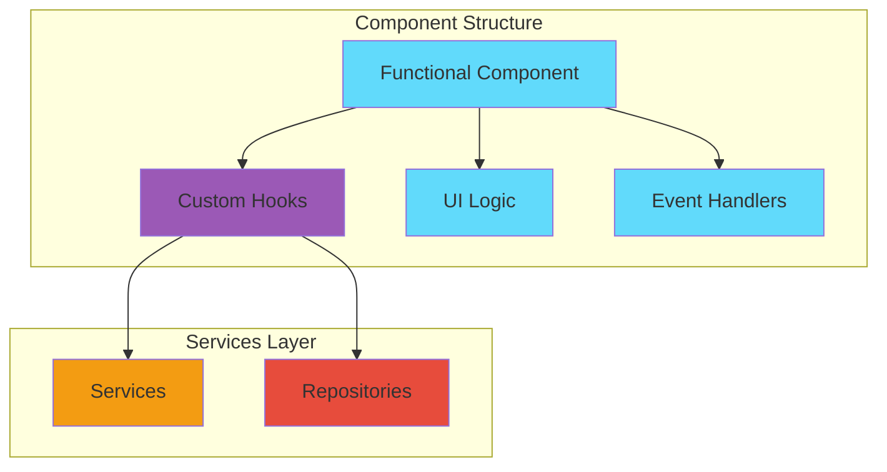

# Component Guidelines

Guidelines for building React components that work with our OOP services architecture.

## Component Architecture



## Component Pattern

### Basic Structure

```typescript
import { useState, useEffect } from 'react';
import { useMessages, useSettings } from '@/hooks';

export function MyComponent() {
  // 1. Hooks (at the top)
  const { messages, addMessage } = useMessages();
  const { settings } = useSettings();
  
  // 2. Local state
  const [input, setInput] = useState('');
  const [isLoading, setIsLoading] = useState(false);
  
  // 3. Effects
  useEffect(() => {
    // Side effects here
  }, []);
  
  // 4. Event handlers
  const handleSubmit = async () => {
    setIsLoading(true);
    try {
      await addMessage({
        id: Date.now().toString(),
        role: 'user',
        content: input,
        timestamp: new Date()
      });
      setInput('');
    } finally {
      setIsLoading(false);
    }
  };
  
  // 5. Render
  return (
    <div>
      <input value={input} onChange={e => setInput(e.target.value)} />
      <button onClick={handleSubmit} disabled={isLoading}>
        Submit
      </button>
    </div>
  );
}
```

## Best Practices

### ✅ DO:

1. **Use Functional Components**
```typescript
// Good
function MyComponent() {
  return <div>Hello</div>;
}

// Avoid
class MyComponent extends React.Component {
  render() {
    return <div>Hello</div>;
  }
}
```

2. **Use Custom Hooks for Services**
```typescript
// Good
function MyComponent() {
  const { data, addItem } = useMyService();
  return <div>{data.length} items</div>;
}

// Avoid - Don't create services in components
function MyComponent() {
  const service = new MyService(); // ❌
  return <div>...</div>;
}
```

3. **Keep Components Focused**
```typescript
// Good - Single responsibility
function MessageList({ messages }) {
  return (
    <div>
      {messages.map(msg => <Message key={msg.id} message={msg} />)}
    </div>
  );
}

function Message({ message }) {
  return <div>{message.content}</div>;
}
```

4. **Handle Loading States**
```typescript
function MyComponent() {
  const { data, isLoading, error } = useData();
  
  if (isLoading) return <LoadingSpinner />;
  if (error) return <ErrorMessage error={error} />;
  
  return <DataDisplay data={data} />;
}
```

### ❌ DON'T:

1. **Don't Put Business Logic in Components**
```typescript
// Bad
function MyComponent() {
  const calculateGrade = (marks) => {
    // Complex calculation logic ❌
    return grade;
  };
  
  return <div>{calculateGrade(marks)}</div>;
}

// Good - Use a service
function MyComponent() {
  const { calculateGrade } = useGradeCalculator();
  return <div>{calculateGrade(marks)}</div>;
}
```

2. **Don't Access Storage Directly**
```typescript
// Bad
function MyComponent() {
  const data = localStorage.getItem('key'); // ❌
  return <div>{data}</div>;
}

// Good - Use a hook/service
function MyComponent() {
  const { data } = useSettings();
  return <div>{data}</div>;
}
```

## Component Examples

### Example 1: Chat Component

```typescript
import { useState, useRef, useEffect } from 'react';
import { useMessages, useSettings, useGemini } from '@/hooks';

export function Chat() {
  const { messages, addMessage, clearMessages } = useMessages();
  const { settings } = useSettings();
  const { sendMessage } = useGemini(settings.apiKey, settings.model);
  
  const [input, setInput] = useState('');
  const [isLoading, setIsLoading] = useState(false);
  const messagesEndRef = useRef<HTMLDivElement>(null);
  
  useEffect(() => {
    messagesEndRef.current?.scrollIntoView({ behavior: 'smooth' });
  }, [messages]);
  
  const handleSend = async () => {
    if (!input.trim() || isLoading) return;
    
    const userMessage = {
      id: Date.now().toString(),
      role: 'user' as const,
      content: input,
      timestamp: new Date()
    };
    
    await addMessage(userMessage);
    setInput('');
    setIsLoading(true);
    
    try {
      const history = [...messages, userMessage].map(m => ({
        role: m.role,
        content: m.content
      }));
      
      const response = await sendMessage(history);
      
      await addMessage({
        id: (Date.now() + 1).toString(),
        role: 'assistant',
        content: response,
        timestamp: new Date()
      });
    } catch (error) {
      console.error('Error:', error);
    } finally {
      setIsLoading(false);
    }
  };
  
  return (
    <div className="chat-container">
      <div className="messages">
        {messages.map(msg => (
          <div key={msg.id} className={`message ${msg.role}`}>
            {msg.content}
          </div>
        ))}
        <div ref={messagesEndRef} />
      </div>
      
      <div className="input-area">
        <input
          value={input}
          onChange={e => setInput(e.target.value)}
          onKeyDown={e => e.key === 'Enter' && handleSend()}
          disabled={isLoading}
        />
        <button onClick={handleSend} disabled={isLoading}>
          Send
        </button>
        <button onClick={clearMessages}>Clear</button>
      </div>
    </div>
  );
}
```

### Example 2: Settings Component

```typescript
import { useState } from 'react';
import { useSettings, useGemini } from '@/hooks';

export function Settings() {
  const { settings, saveSettings, availableModels } = useSettings();
  const [localSettings, setLocalSettings] = useState(settings);
  const [isTesting, setIsTesting] = useState(false);
  const [testResult, setTestResult] = useState<boolean | null>(null);
  
  const { testConnection } = useGemini(
    localSettings.apiKey,
    localSettings.model
  );
  
  const handleSave = () => {
    saveSettings(localSettings);
    alert('Settings saved!');
  };
  
  const handleTest = async () => {
    setIsTesting(true);
    const isValid = await testConnection();
    setTestResult(isValid);
    setIsTesting(false);
  };
  
  return (
    <div className="settings">
      <h1>Settings</h1>
      
      <label>
        <input
          type="checkbox"
          checked={localSettings.useCustomApi}
          onChange={e => setLocalSettings({
            ...localSettings,
            useCustomApi: e.target.checked
          })}
        />
        Use Custom API
      </label>
      
      {localSettings.useCustomApi && (
        <>
          <input
            type="password"
            value={localSettings.apiKey}
            onChange={e => setLocalSettings({
              ...localSettings,
              apiKey: e.target.value
            })}
            placeholder="API Key"
          />
          
          <select
            value={localSettings.model}
            onChange={e => setLocalSettings({
              ...localSettings,
              model: e.target.value
            })}
          >
            {availableModels.map(model => (
              <option key={model.id} value={model.id}>
                {model.name}
              </option>
            ))}
          </select>
          
          <button onClick={handleTest} disabled={isTesting}>
            {isTesting ? 'Testing...' : 'Test Connection'}
          </button>
          
          {testResult !== null && (
            <div className={testResult ? 'success' : 'error'}>
              {testResult ? '✓ Valid' : '✗ Invalid'}
            </div>
          )}
        </>
      )}
      
      <button onClick={handleSave}>Save Settings</button>
    </div>
  );
}
```

## Next Steps

- [Architecture Overview](./ARCHITECTURE.md)
- [Services Documentation](./SERVICES.md)
- [Hooks Documentation](./HOOKS.md)
