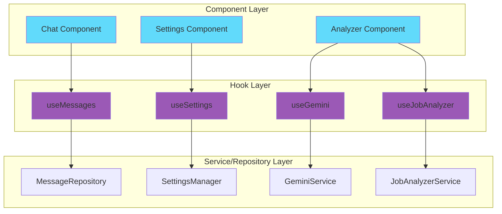

# Hooks Documentation

Custom hooks bridge the gap between React components and OOP services/repositories. They provide a clean, functional interface for components.

## Table of Contents

- [Hook Architecture](#hook-architecture)
- [Available Hooks](#available-hooks)
- [Usage Examples](#usage-examples)
- [Creating New Hooks](#creating-new-hooks)

## Hook Architecture



## Available Hooks

### 1. useMessages

Manages chat messages with IndexedDB persistence.

```typescript
function useMessages(): {
  messages: ChatMessage[];
  isLoading: boolean;
  addMessage: (message: ChatMessage) => Promise<void>;
  clearMessages: () => Promise<void>;
  searchMessages: (query: string) => Promise<ChatMessage[]>;
}
```

**Usage**:
```typescript
import { useMessages } from '@/hooks';

function ChatComponent() {
  const { messages, isLoading, addMessage, clearMessages } = useMessages();
  
  if (isLoading) return <div>Loading...</div>;
  
  return (
    <div>
      {messages.map(msg => (
        <div key={msg.id}>{msg.content}</div>
      ))}
      <button onClick={clearMessages}>Clear</button>
    </div>
  );
}
```


### 2. useSettings

Manages application settings with localStorage persistence.

```typescript
function useSettings(): {
  settings: AppSettings;
  saveSettings: (settings: AppSettings) => void;
  clearSettings: () => void;
  availableModels: Model[];
}
```

**Usage**:
```typescript
import { useSettings } from '@/hooks';

function SettingsComponent() {
  const { settings, saveSettings, availableModels } = useSettings();
  
  const handleSave = () => {
    saveSettings({
      ...settings,
      apiKey: 'new-key'
    });
  };
  
  return (
    <div>
      <input value={settings.apiKey} />
      <select value={settings.model}>
        {availableModels.map(m => (
          <option key={m.id} value={m.id}>{m.name}</option>
        ))}
      </select>
      <button onClick={handleSave}>Save</button>
    </div>
  );
}
```

### 3. useGemini

Provides interface to Gemini AI service.

```typescript
function useGemini(apiKey: string, model: string): {
  sendMessage: (history: ChatHistoryMessage[]) => Promise<string>;
  testConnection: () => Promise<boolean>;
}
```

**Usage**:
```typescript
import { useGemini } from '@/hooks';
import { useSettings } from '@/hooks';

function ChatComponent() {
  const { settings } = useSettings();
  const { sendMessage, testConnection } = useGemini(
    settings.apiKey,
    settings.model
  );
  
  const handleSend = async () => {
    const response = await sendMessage([
      { role: 'user', content: 'Hello!' }
    ]);
    console.log(response);
  };
  
  const handleTest = async () => {
    const isValid = await testConnection();
    alert(isValid ? 'Connected!' : 'Failed');
  };
  
  return (
    <div>
      <button onClick={handleSend}>Send</button>
      <button onClick={handleTest}>Test</button>
    </div>
  );
}
```

### 4. useJobAnalyzer

Provides job document analysis functionality.

```typescript
function useJobAnalyzer(): {
  checkHealth: () => Promise<boolean>;
  analyzeDocument: (request: AnalyzeRequest) => Promise<AnalysisResult>;
  analyzeResume: (request: ResumeAnalyzeRequest) => Promise<ResumeAnalysisResult>;
  fileToBase64: (file: File) => Promise<string>;
}
```

**Usage**:
```typescript
import { useJobAnalyzer } from '@/hooks';

function AnalyzerComponent() {
  const { analyzeDocument, fileToBase64 } = useJobAnalyzer();
  const [result, setResult] = useState(null);
  
  const handleAnalyze = async (file: File) => {
    const base64 = await fileToBase64(file);
    const analysis = await analyzeDocument({
      api_key: 'your-key',
      document: base64,
      filename: file.name
    });
    setResult(analysis);
  };
  
  return (
    <div>
      <input type="file" onChange={e => handleAnalyze(e.target.files[0])} />
      {result && <div>Risk: {result.risk_level}</div>}
    </div>
  );
}
```

### 5. useJobAnalyzerSettings

Manages job analyzer settings separately.

```typescript
function useJobAnalyzerSettings(): {
  settings: JobAnalyzerSettings;
  saveSettings: (settings: JobAnalyzerSettings) => void;
  clearSettings: () => void;
  availableModels: Model[];
}
```

### 6. useAnalysisHistory

Manages analysis history for agreements and resumes.

```typescript
function useAnalysisHistory(): {
  agreementHistory: AgreementHistoryItem[];
  resumeHistory: ResumeHistoryItem[];
  loadAgreementHistory: () => Promise<void>;
  loadResumeHistory: () => Promise<void>;
  saveAgreementAnalysis: (filename: string, result: AnalysisResult) => Promise<void>;
  saveResumeAnalysis: (filename: string, result: ResumeAnalysisResult) => Promise<void>;
  deleteAgreementAnalysis: (id: number) => Promise<void>;
  deleteResumeAnalysis: (id: number) => Promise<void>;
  clearAgreementHistory: () => Promise<void>;
  clearResumeHistory: () => Promise<void>;
}
```

**Usage**:
```typescript
import { useAnalysisHistory } from '@/hooks';

function HistoryComponent() {
  const {
    agreementHistory,
    loadAgreementHistory,
    deleteAgreementAnalysis
  } = useAnalysisHistory();
  
  useEffect(() => {
    loadAgreementHistory();
  }, []);
  
  return (
    <div>
      {agreementHistory.map(item => (
        <div key={item.id}>
          <span>{item.filename}</span>
          <span>Risk: {item.result.risk_level}</span>
          <button onClick={() => deleteAgreementAnalysis(item.id)}>
            Delete
          </button>
        </div>
      ))}
    </div>
  );
}
```

## Usage Examples

### Example 1: Complete Chat Flow

```typescript
import { useMessages, useSettings, useGemini } from '@/hooks';
import { useState } from 'react';

function ChatPage() {
  const { messages, addMessage } = useMessages();
  const { settings } = useSettings();
  const { sendMessage } = useGemini(settings.apiKey, settings.model);
  const [input, setInput] = useState('');
  const [isLoading, setIsLoading] = useState(false);
  
  const handleSend = async () => {
    if (!input.trim()) return;
    
    // Add user message
    const userMessage = {
      id: Date.now().toString(),
      role: 'user' as const,
      content: input,
      timestamp: new Date()
    };
    await addMessage(userMessage);
    
    setIsLoading(true);
    
    try {
      // Get AI response
      const history = [...messages, userMessage].map(m => ({
        role: m.role,
        content: m.content
      }));
      
      const response = await sendMessage(history);
      
      // Add AI message
      await addMessage({
        id: (Date.now() + 1).toString(),
        role: 'assistant',
        content: response,
        timestamp: new Date()
      });
    } catch (error) {
      console.error('Error:', error);
    } finally {
      setIsLoading(false);
      setInput('');
    }
  };
  
  return (
    <div>
      <div>
        {messages.map(msg => (
          <div key={msg.id}>{msg.content}</div>
        ))}
      </div>
      <input
        value={input}
        onChange={e => setInput(e.target.value)}
        disabled={isLoading}
      />
      <button onClick={handleSend} disabled={isLoading}>
        Send
      </button>
    </div>
  );
}
```

### Example 2: Document Analysis with History

```typescript
import { useJobAnalyzer, useAnalysisHistory, useJobAnalyzerSettings } from '@/hooks';
import { useState } from 'react';

function DocumentAnalyzer() {
  const { analyzeDocument, fileToBase64 } = useJobAnalyzer();
  const { saveAgreementAnalysis } = useAnalysisHistory();
  const { settings } = useJobAnalyzerSettings();
  const [result, setResult] = useState(null);
  const [isAnalyzing, setIsAnalyzing] = useState(false);
  
  const handleFileUpload = async (file: File) => {
    setIsAnalyzing(true);
    
    try {
      // Convert to base64
      const base64 = await fileToBase64(file);
      
      // Analyze
      const analysis = await analyzeDocument({
        api_key: settings.apiKey,
        document: base64,
        filename: file.name
      });
      
      // Save to history
      await saveAgreementAnalysis(file.name, analysis);
      
      setResult(analysis);
    } catch (error) {
      console.error('Analysis failed:', error);
    } finally {
      setIsAnalyzing(false);
    }
  };
  
  return (
    <div>
      <input
        type="file"
        onChange={e => handleFileUpload(e.target.files[0])}
        disabled={isAnalyzing}
      />
      {isAnalyzing && <div>Analyzing...</div>}
      {result && (
        <div>
          <h3>Risk Score: {result.risk_score}</h3>
          <p>Level: {result.risk_level}</p>
          <p>{result.summary}</p>
        </div>
      )}
    </div>
  );
}
```

## Creating New Hooks

### Step 1: Identify the Need

Create a hook when you need to:
- Share logic between components
- Manage state with side effects
- Interact with services/repositories
- Handle complex async operations

### Step 2: Create the Hook

```typescript
import { useState, useEffect, useMemo } from 'react';
import { MyService } from '@/services';

export function useMyFeature(config: ConfigType) {
  const [data, setData] = useState<DataType[]>([]);
  const [isLoading, setIsLoading] = useState(true);
  const [error, setError] = useState<Error | null>(null);
  
  // Create service instance (memoized)
  const service = useMemo(() => new MyService(config), [config]);
  
  // Load data on mount
  useEffect(() => {
    const loadData = async () => {
      try {
        setIsLoading(true);
        const result = await service.fetchData();
        setData(result);
      } catch (err) {
        setError(err as Error);
      } finally {
        setIsLoading(false);
      }
    };
    
    loadData();
  }, [service]);
  
  // Provide methods
  const addItem = async (item: DataType) => {
    await service.addItem(item);
    setData(prev => [...prev, item]);
  };
  
  const removeItem = async (id: string) => {
    await service.removeItem(id);
    setData(prev => prev.filter(item => item.id !== id));
  };
  
  return {
    data,
    isLoading,
    error,
    addItem,
    removeItem
  };
}
```

### Step 3: Export from index.ts

```typescript
// src/hooks/index.ts
export { useMyFeature } from './useMyFeature';
```

### Step 4: Use in Components

```typescript
import { useMyFeature } from '@/hooks';

function MyComponent() {
  const { data, isLoading, addItem } = useMyFeature({ apiKey: 'key' });
  
  if (isLoading) return <div>Loading...</div>;
  
  return (
    <div>
      {data.map(item => <div key={item.id}>{item.name}</div>)}
      <button onClick={() => addItem({ id: '1', name: 'New' })}>
        Add
      </button>
    </div>
  );
}
```

## Best Practices

### ✅ DO:
- Use `useMemo` for service instances
- Use `useEffect` for side effects
- Return objects with named properties
- Handle loading and error states
- Keep hooks focused (single responsibility)
- Use TypeScript for type safety

### ❌ DON'T:
- Create service instances on every render
- Put UI logic in hooks
- Return arrays (use objects instead)
- Forget cleanup in useEffect
- Mix multiple concerns in one hook

## Hook Patterns

### Pattern 1: Data Fetching Hook

```typescript
export function useDataFetching<T>(fetcher: () => Promise<T>) {
  const [data, setData] = useState<T | null>(null);
  const [isLoading, setIsLoading] = useState(true);
  const [error, setError] = useState<Error | null>(null);
  
  useEffect(() => {
    let cancelled = false;
    
    const fetch = async () => {
      try {
        setIsLoading(true);
        const result = await fetcher();
        if (!cancelled) {
          setData(result);
        }
      } catch (err) {
        if (!cancelled) {
          setError(err as Error);
        }
      } finally {
        if (!cancelled) {
          setIsLoading(false);
        }
      }
    };
    
    fetch();
    
    return () => {
      cancelled = true;
    };
  }, [fetcher]);
  
  return { data, isLoading, error };
}
```

### Pattern 2: Service Hook

```typescript
export function useService<T extends new (...args: any[]) => any>(
  ServiceClass: T,
  ...args: ConstructorParameters<T>
) {
  const service = useMemo(
    () => new ServiceClass(...args),
    [ServiceClass, ...args]
  );
  
  return service;
}

// Usage
const geminiService = useService(GeminiService, apiKey, model, instructions);
```

### Pattern 3: Async Action Hook

```typescript
export function useAsyncAction<T, Args extends any[]>(
  action: (...args: Args) => Promise<T>
) {
  const [isLoading, setIsLoading] = useState(false);
  const [error, setError] = useState<Error | null>(null);
  
  const execute = async (...args: Args): Promise<T | null> => {
    try {
      setIsLoading(true);
      setError(null);
      const result = await action(...args);
      return result;
    } catch (err) {
      setError(err as Error);
      return null;
    } finally {
      setIsLoading(false);
    }
  };
  
  return { execute, isLoading, error };
}

// Usage
const { execute, isLoading } = useAsyncAction(analyzeDocument);
```

## Testing Hooks

```typescript
import { renderHook, act } from '@testing-library/react';
import { useMessages } from '@/hooks';

describe('useMessages', () => {
  it('should load messages on mount', async () => {
    const { result, waitForNextUpdate } = renderHook(() => useMessages());
    
    expect(result.current.isLoading).toBe(true);
    
    await waitForNextUpdate();
    
    expect(result.current.isLoading).toBe(false);
    expect(result.current.messages).toBeDefined();
  });
  
  it('should add message', async () => {
    const { result } = renderHook(() => useMessages());
    
    await act(async () => {
      await result.current.addMessage({
        id: '1',
        role: 'user',
        content: 'Test',
        timestamp: new Date()
      });
    });
    
    expect(result.current.messages).toHaveLength(1);
  });
});
```

## Next Steps

- [Services Documentation](./SERVICES.md)
- [Repositories Documentation](./REPOSITORIES.md)
- [Architecture Overview](./ARCHITECTURE.md)
- [Component Guidelines](./COMPONENTS.md)
