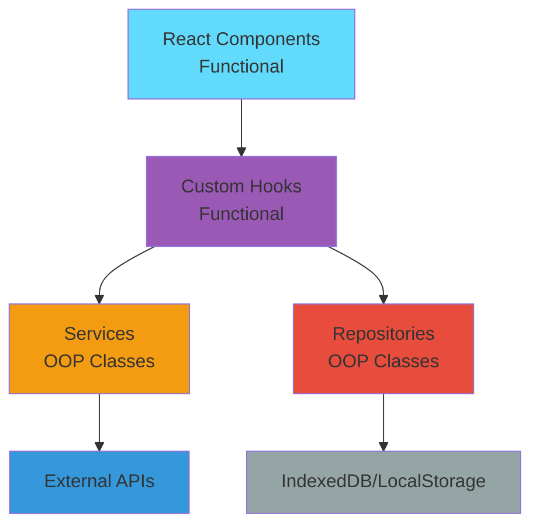
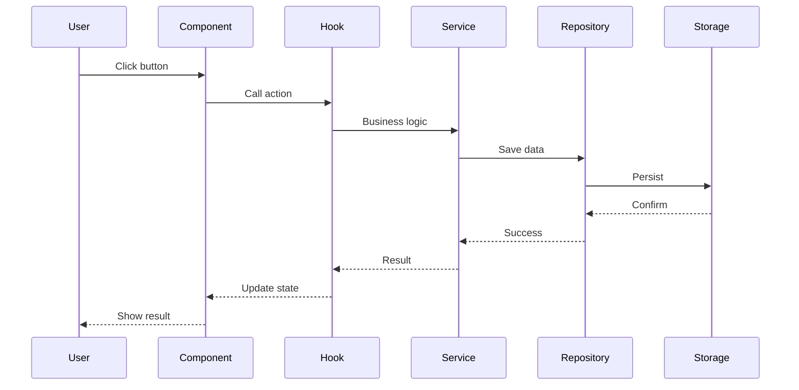

# Anie AI - Documentation

Welcome to the Anie AI documentation! This guide will help you understand the architecture and how to work with the codebase.

## 📚 Documentation Index

### Core Documentation

1. **[Architecture Overview](./ARCHITECTURE.md)** - Start here!
   - Understand the hybrid OOP + Functional approach
   - See the complete system architecture
   - Learn about data flow and design principles

2. **[Services Documentation](./SERVICES.md)**
   - Learn about all available services
   - Understand the service layer
   - See usage examples and best practices

3. **[Repositories Documentation](./REPOSITORIES.md)**
   - Data persistence patterns
   - IndexedDB and LocalStorage usage
   - Repository pattern implementation

4. **[Hooks Documentation](./HOOKS.md)**
   - Custom React hooks
   - Bridge between UI and services
   - Hook patterns and examples

5. **[Component Guidelines](./COMPONENTS.md)**
   - React component best practices
   - Component patterns
   - Integration with services

## 🚀 Quick Start

### Understanding the Architecture



### Key Concepts

**Functional Layer (UI)**
- React components with hooks
- No business logic
- Clean, declarative code

**Hook Layer (Bridge)**
- Custom hooks connect UI to services
- Manage state and side effects
- Provide clean API to components

**Service Layer (Business Logic)**
- OOP classes for business logic
- API interactions
- Reusable across components

**Repository Layer (Data Access)**
- OOP classes for data persistence
- Abstract storage mechanisms
- Consistent interface


## 📖 Learning Path

### For New Developers

1. **Start with Architecture** → Read [ARCHITECTURE.md](./ARCHITECTURE.md)
2. **Understand Services** → Read [SERVICES.md](./SERVICES.md)
3. **Learn Repositories** → Read [REPOSITORIES.md](./REPOSITORIES.md)
4. **Master Hooks** → Read [HOOKS.md](./HOOKS.md)
5. **Build Components** → Read [COMPONENTS.md](./COMPONENTS.md)

### For Experienced Developers

Jump to specific sections:
- Need to add a new API? → [Services](./SERVICES.md#creating-new-services)
- Need to store data? → [Repositories](./REPOSITORIES.md#creating-new-repositories)
- Need to connect UI? → [Hooks](./HOOKS.md#creating-new-hooks)

## 🏗️ Project Structure

```
src/
├── components/          # React components (Functional)
│   ├── DeviceGuard.tsx
│   └── MessageContent.tsx
│
├── pages/              # Page components (Functional)
│   ├── Chat.tsx
│   ├── Home.tsx
│   └── Settings.tsx
│
├── hooks/              # Custom hooks (Functional)
│   ├── useMessages.ts
│   ├── useSettings.ts
│   ├── useGemini.ts
│   └── index.ts
│
├── services/           # Business logic (OOP)
│   ├── ApiService.ts
│   ├── GeminiService.ts
│   ├── JobAnalyzerService.ts
│   ├── SettingsManager.ts
│   └── index.ts
│
├── repositories/       # Data access (OOP)
│   ├── MessageRepository.ts
│   ├── AnalysisHistoryRepository.ts
│   └── index.ts
│
├── constants/          # Constants and config
│   └── geminiInstructions.ts
│
├── lib/               # Legacy utilities (being migrated)
│   ├── db.ts
│   ├── device.ts
│   └── firebase.ts
│
└── features/          # Feature modules
    └── job-analyzer/
```

## 🎯 Common Tasks

### Task 1: Add a New API Endpoint

```typescript
// 1. Extend ApiService
class MyApiService extends ApiService {
  constructor() {
    super('https://api.example.com');
  }
  
  async fetchData() {
    return this.get<DataType>('/endpoint');
  }
}

// 2. Create a hook
export function useMyApi() {
  const service = useMemo(() => new MyApiService(), []);
  return { fetchData: service.fetchData.bind(service) };
}

// 3. Use in component
function MyComponent() {
  const { fetchData } = useMyApi();
  // Use fetchData...
}
```

### Task 2: Add Data Persistence

```typescript
// 1. Create repository
export class MyRepository {
  async save(data: DataType) {
    await db.myTable.add(data);
  }
  
  async getAll() {
    return db.myTable.toArray();
  }
}

// 2. Create hook
export function useMyData() {
  const repo = useMemo(() => new MyRepository(), []);
  const [data, setData] = useState([]);
  
  useEffect(() => {
    repo.getAll().then(setData);
  }, []);
  
  return { data, save: repo.save.bind(repo) };
}

// 3. Use in component
function MyComponent() {
  const { data, save } = useMyData();
  // Use data and save...
}
```

### Task 3: Add Settings

```typescript
// 1. Extend SettingsManager or create new manager
class MySettingsManager {
  private static instance: MySettingsManager;
  
  static getInstance() {
    if (!MySettingsManager.instance) {
      MySettingsManager.instance = new MySettingsManager();
    }
    return MySettingsManager.instance;
  }
  
  getSettings() {
    return JSON.parse(localStorage.getItem('my-settings') || '{}');
  }
  
  saveSettings(settings: any) {
    localStorage.setItem('my-settings', JSON.stringify(settings));
  }
}

// 2. Create hook
export function useMySettings() {
  const manager = useMemo(() => MySettingsManager.getInstance(), []);
  const [settings, setSettings] = useState(manager.getSettings());
  
  const save = (newSettings: any) => {
    manager.saveSettings(newSettings);
    setSettings(newSettings);
  };
  
  return { settings, save };
}
```

## 🔍 Code Examples

### Example: Complete Feature Implementation



## 🧪 Testing

### Testing Services

```typescript
import { GeminiService } from '@/services';

describe('GeminiService', () => {
  it('should send message', async () => {
    const service = new GeminiService('key', 'model', 'instructions');
    const response = await service.sendMessage([
      { role: 'user', content: 'Hello' }
    ]);
    expect(response).toBeDefined();
  });
});
```

### Testing Hooks

```typescript
import { renderHook } from '@testing-library/react';
import { useMessages } from '@/hooks';

describe('useMessages', () => {
  it('should load messages', async () => {
    const { result, waitForNextUpdate } = renderHook(() => useMessages());
    await waitForNextUpdate();
    expect(result.current.messages).toBeDefined();
  });
});
```

## 📝 Best Practices Summary

### ✅ DO:
- Use functional components with hooks
- Use services for business logic
- Use repositories for data access
- Keep components focused and simple
- Handle loading and error states
- Use TypeScript for type safety

### ❌ DON'T:
- Put business logic in components
- Access storage directly from components
- Create service instances in render
- Mix concerns in single file
- Forget error handling

## 🤝 Contributing

When adding new features:

1. **Plan the architecture** - Which layer does it belong to?
2. **Create the service/repository** - Business logic and data access
3. **Create the hook** - Bridge to components
4. **Update components** - Use the hook
5. **Document** - Update relevant docs
6. **Test** - Write tests for services and hooks

## 📚 Additional Resources

- [React Hooks Documentation](https://react.dev/reference/react)
- [TypeScript Handbook](https://www.typescriptlang.org/docs/)
- [IndexedDB API](https://developer.mozilla.org/en-US/docs/Web/API/IndexedDB_API)
- [Dexie.js Documentation](https://dexie.org/)

## 🆘 Getting Help

- Check the relevant documentation section
- Look at existing code examples
- Review the architecture diagrams
- Ask in team discussions

## 📄 License

This project is part of Xeze organization.

---

**Happy Coding! 🚀**
