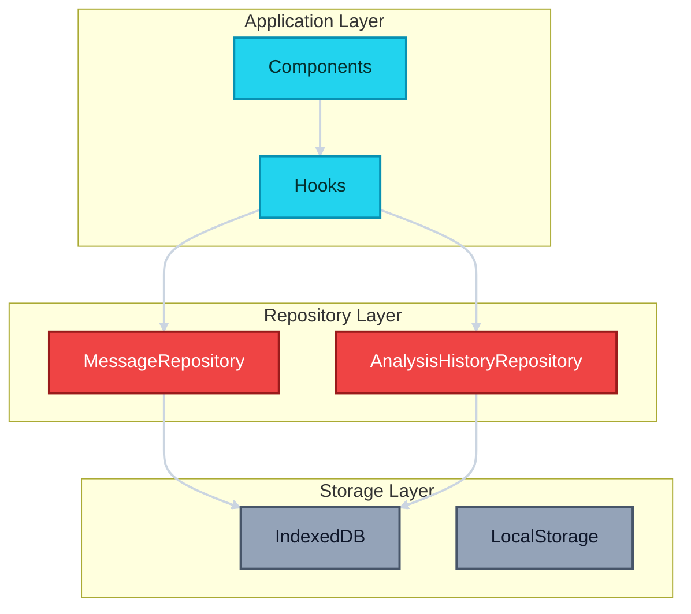
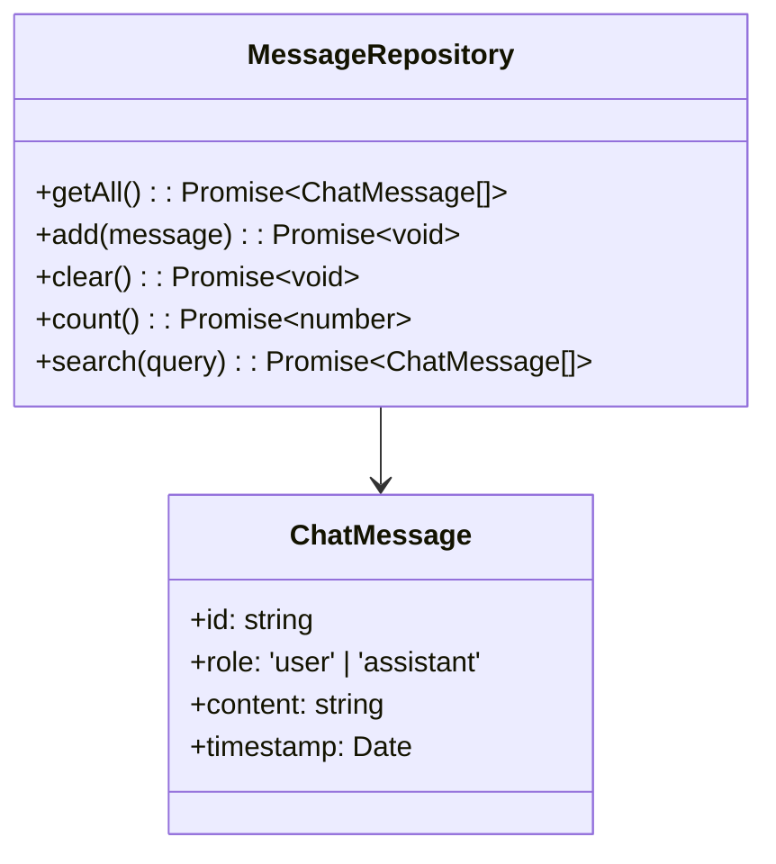
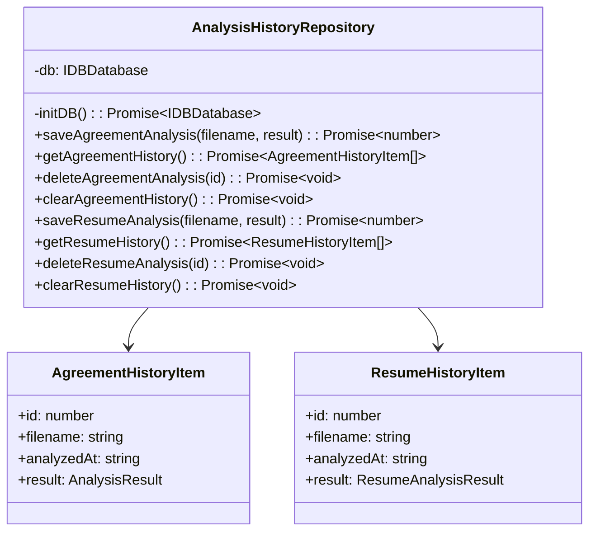

# Repositories Documentation

Repositories handle data persistence and provide a clean abstraction over storage mechanisms (IndexedDB, LocalStorage).

## Table of Contents

- [Repository Pattern](#repository-pattern)
- [Available Repositories](#available-repositories)
- [Usage Examples](#usage-examples)
- [Creating New Repositories](#creating-new-repositories)

## Repository Pattern



**Benefits**:
- Abstraction over storage mechanisms
- Consistent interface for data operations
- Easy to swap storage implementations
- Centralized error handling
- Type-safe operations

## Available Repositories

### 1. MessageRepository

Manages chat messages in IndexedDB using Dexie.



**Usage**:
```typescript
import { MessageRepository } from '@/repositories';

const repo = new MessageRepository();

// Get all messages
const messages = await repo.getAll();

// Add a message
await repo.add({
  id: Date.now().toString(),
  role: 'user',
  content: 'Hello!',
  timestamp: new Date()
});

// Search messages
const results = await repo.search('grade');

// Clear all messages
await repo.clear();

// Get message count
const count = await repo.count();
```


**Methods**:

| Method | Parameters | Returns | Description |
|--------|-----------|---------|-------------|
| `getAll` | - | `Promise<ChatMessage[]>` | Get all messages ordered by timestamp |
| `add` | `message: ChatMessage` | `Promise<void>` | Add a new message |
| `clear` | - | `Promise<void>` | Delete all messages |
| `count` | - | `Promise<number>` | Get total message count |
| `search` | `query: string` | `Promise<ChatMessage[]>` | Search messages by content |

### 2. AnalysisHistoryRepository

Manages analysis history for both agreements and resumes in IndexedDB.



**Usage**:
```typescript
import { AnalysisHistoryRepository } from '@/repositories';

const repo = new AnalysisHistoryRepository();

// Save agreement analysis
const id = await repo.saveAgreementAnalysis('contract.pdf', {
  risk_score: 75,
  risk_level: 'HIGH',
  summary: 'Several red flags detected',
  scam_indicators: [],
  risky_clauses: [],
  missing_elements: [],
  recommendations: []
});

// Get agreement history
const history = await repo.getAgreementHistory();

// Delete specific analysis
await repo.deleteAgreementAnalysis(id);

// Clear all agreement history
await repo.clearAgreementHistory();

// Resume operations work the same way
await repo.saveResumeAnalysis('resume.pdf', result);
const resumeHistory = await repo.getResumeHistory();
```

**Agreement Methods**:

| Method | Parameters | Returns | Description |
|--------|-----------|---------|-------------|
| `saveAgreementAnalysis` | `filename: string, result: AnalysisResult` | `Promise<number>` | Save analysis and return ID |
| `getAgreementHistory` | - | `Promise<AgreementHistoryItem[]>` | Get all analyses (newest first) |
| `deleteAgreementAnalysis` | `id: number` | `Promise<void>` | Delete specific analysis |
| `clearAgreementHistory` | - | `Promise<void>` | Delete all analyses |

**Resume Methods**:

| Method | Parameters | Returns | Description |
|--------|-----------|---------|-------------|
| `saveResumeAnalysis` | `filename: string, result: ResumeAnalysisResult` | `Promise<number>` | Save analysis and return ID |
| `getResumeHistory` | - | `Promise<ResumeHistoryItem[]>` | Get all analyses (newest first) |
| `deleteResumeAnalysis` | `id: number` | `Promise<void>` | Delete specific analysis |
| `clearResumeHistory` | - | `Promise<void>` | Delete all analyses |

## Usage Examples

### Example 1: Chat Message Management

```typescript
import { MessageRepository } from '@/repositories';

async function manageChatMessages() {
  const repo = new MessageRepository();
  
  // Load existing messages
  const messages = await repo.getAll();
  console.log(`Loaded ${messages.length} messages`);
  
  // Add user message
  await repo.add({
    id: Date.now().toString(),
    role: 'user',
    content: 'Calculate my grade',
    timestamp: new Date()
  });
  
  // Add AI response
  await repo.add({
    id: (Date.now() + 1).toString(),
    role: 'assistant',
    content: 'Sure! Please provide your marks.',
    timestamp: new Date()
  });
  
  // Search for specific topic
  const gradeMessages = await repo.search('grade');
  console.log(`Found ${gradeMessages.length} messages about grades`);
}
```

### Example 2: Analysis History Management

```typescript
import { AnalysisHistoryRepository } from '@/repositories';

async function manageAnalysisHistory() {
  const repo = new AnalysisHistoryRepository();
  
  // Save new analysis
  const analysisResult = {
    risk_score: 65,
    risk_level: 'MEDIUM' as const,
    summary: 'Some concerns found',
    scam_indicators: [],
    risky_clauses: [],
    missing_elements: ['Termination clause'],
    recommendations: ['Review termination terms']
  };
  
  const id = await repo.saveAgreementAnalysis(
    'employment_contract.pdf',
    analysisResult
  );
  
  console.log(`Saved analysis with ID: ${id}`);
  
  // Load history
  const history = await repo.getAgreementHistory();
  console.log(`Total analyses: ${history.length}`);
  
  // Display recent analyses
  history.slice(0, 5).forEach(item => {
    console.log(`${item.filename} - Risk: ${item.result.risk_level}`);
  });
  
  // Delete old analyses (keep last 10)
  if (history.length > 10) {
    const toDelete = history.slice(10);
    for (const item of toDelete) {
      await repo.deleteAgreementAnalysis(item.id);
    }
  }
}
```

### Example 3: Data Migration

```typescript
import { MessageRepository } from '@/repositories';

async function migrateData() {
  const repo = new MessageRepository();
  
  // Export data
  const messages = await repo.getAll();
  const backup = JSON.stringify(messages);
  localStorage.setItem('messages_backup', backup);
  
  // Clear current data
  await repo.clear();
  
  // Import data
  const restored = JSON.parse(localStorage.getItem('messages_backup')!);
  for (const message of restored) {
    await repo.add({
      ...message,
      timestamp: new Date(message.timestamp)
    });
  }
  
  console.log('Data migration complete');
}
```

## Creating New Repositories

### Step 1: Define Data Model

```typescript
// types.ts
export interface MyDataItem {
  id: number;
  name: string;
  createdAt: Date;
  data: unknown;
}
```

### Step 2: Create Repository Class

```typescript
import Dexie, { type EntityTable } from 'dexie';

class MyDatabase extends Dexie {
  items!: EntityTable<MyDataItem, 'id'>;
  
  constructor() {
    super('MyDatabase');
    this.version(1).stores({
      items: 'id, name, createdAt'
    });
  }
}

const db = new MyDatabase();

export class MyRepository {
  async getAll(): Promise<MyDataItem[]> {
    try {
      return await db.items.orderBy('createdAt').toArray();
    } catch (error) {
      console.error('Error loading items:', error);
      return [];
    }
  }
  
  async add(item: MyDataItem): Promise<void> {
    try {
      await db.items.add(item);
    } catch (error) {
      console.error('Error adding item:', error);
    }
  }
  
  async delete(id: number): Promise<void> {
    try {
      await db.items.delete(id);
    } catch (error) {
      console.error('Error deleting item:', error);
    }
  }
  
  async clear(): Promise<void> {
    try {
      await db.items.clear();
    } catch (error) {
      console.error('Error clearing items:', error);
    }
  }
}
```

### Step 3: Export from index.ts

```typescript
// src/repositories/index.ts
export { MyRepository } from './MyRepository';
export type { MyDataItem } from './MyRepository';
```

## Best Practices

### ✅ DO:
- Use repositories for all data access
- Handle errors gracefully
- Return empty arrays instead of throwing on read errors
- Use TypeScript for type safety
- Index frequently queried fields
- Use transactions for multiple operations

### ❌ DON'T:
- Access storage directly from components
- Throw errors on read operations
- Store sensitive data without encryption
- Forget to handle promise rejections
- Mix business logic with data access

## Error Handling

```typescript
export class SafeRepository {
  async getAll(): Promise<DataItem[]> {
    try {
      const items = await db.items.toArray();
      return items;
    } catch (error) {
      console.error('Failed to load items:', error);
      // Return empty array instead of throwing
      return [];
    }
  }
  
  async add(item: DataItem): Promise<boolean> {
    try {
      await db.items.add(item);
      return true;
    } catch (error) {
      console.error('Failed to add item:', error);
      // Return false to indicate failure
      return false;
    }
  }
}
```

## Testing Repositories

```typescript
import { MessageRepository } from '@/repositories';

describe('MessageRepository', () => {
  let repo: MessageRepository;
  
  beforeEach(() => {
    repo = new MessageRepository();
  });
  
  afterEach(async () => {
    await repo.clear();
  });
  
  it('should add and retrieve messages', async () => {
    const message = {
      id: '1',
      role: 'user' as const,
      content: 'Test',
      timestamp: new Date()
    };
    
    await repo.add(message);
    const messages = await repo.getAll();
    
    expect(messages).toHaveLength(1);
    expect(messages[0].content).toBe('Test');
  });
  
  it('should search messages', async () => {
    await repo.add({
      id: '1',
      role: 'user',
      content: 'Calculate grade',
      timestamp: new Date()
    });
    
    const results = await repo.search('grade');
    expect(results).toHaveLength(1);
  });
});
```

## Next Steps

- [Services Documentation](./SERVICES.md)
- [Hooks Documentation](./HOOKS.md)
- [Architecture Overview](./ARCHITECTURE.md)
