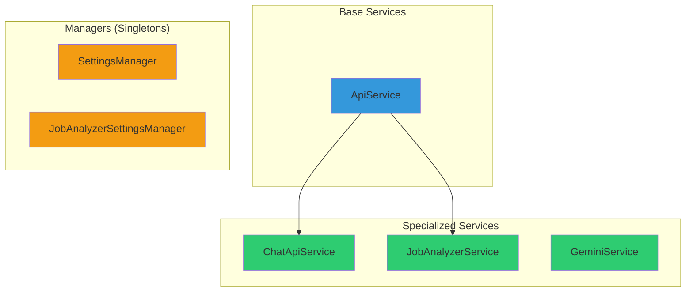
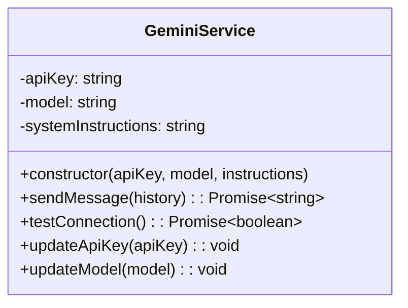
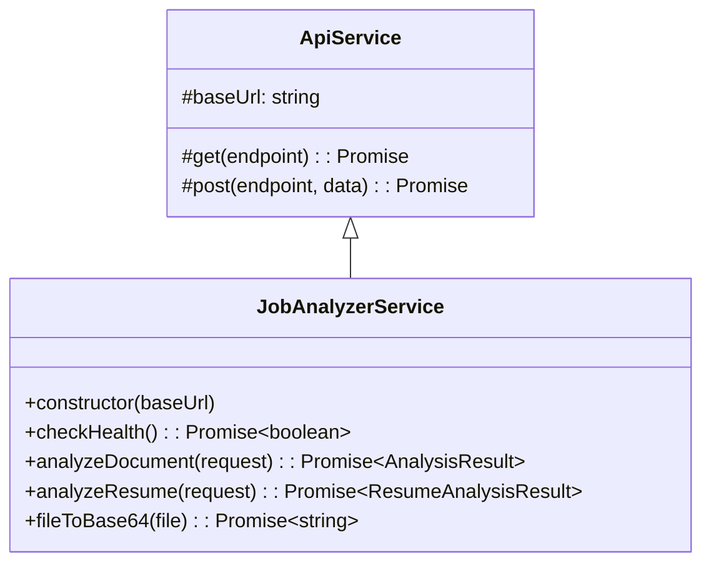
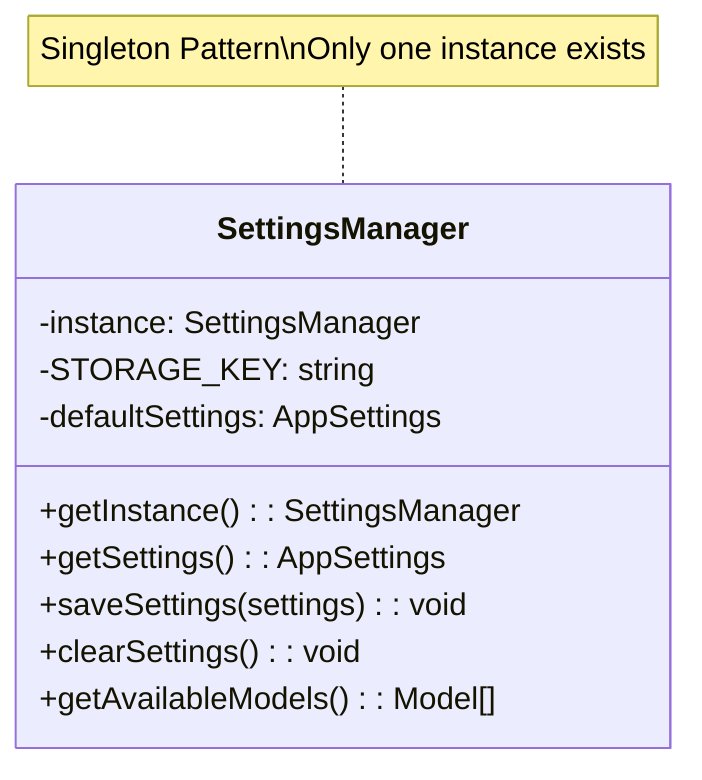

# Services Documentation

Services encapsulate business logic and external API interactions. All services are implemented as classes following OOP principles.

## Table of Contents

- [Service Architecture](#service-architecture)
- [Available Services](#available-services)
- [Usage Examples](#usage-examples)
- [Creating New Services](#creating-new-services)

## Service Architecture



## Available Services

### 1. ApiService (Base Class)

Base class for all HTTP-based services.

```typescript
class ApiService {
  protected baseUrl: string;
  
  constructor(baseUrl: string);
  protected get<T>(endpoint: string, signal?: AbortSignal): Promise<T>;
  protected post<T>(endpoint: string, data: unknown): Promise<T>;
  protected getBaseUrl(): string;
}
```

**Features**:
- Centralized error handling
- Type-safe requests
- Abort signal support
- Automatic JSON parsing

**Example**:
```typescript
class MyApiService extends ApiService {
  constructor() {
    super('https://api.example.com');
  }
  
  async fetchData() {
    return this.get<DataType>('/endpoint');
  }
}
```

### 2. GeminiService

Handles interactions with Google Gemini AI.



**Usage**:
```typescript
import { GeminiService } from '@/services';
import { SYSTEM_INSTRUCTIONS } from '@/constants/geminiInstructions';

const service = new GeminiService(
  'your-api-key',
  'gemini-2.5-flash',
  SYSTEM_INSTRUCTIONS
);

// Send a message
const response = await service.sendMessage([
  { role: 'user', content: 'Hello!' }
]);

// Test connection
const isValid = await service.testConnection();
```

**Methods**:

| Method | Parameters | Returns | Description |
|--------|-----------|---------|-------------|
| `sendMessage` | `history: ChatHistoryMessage[]` | `Promise<string>` | Send message with conversation history |
| `testConnection` | - | `Promise<boolean>` | Test if API key is valid |
| `updateApiKey` | `apiKey: string` | `void` | Update API key |
| `updateModel` | `model: string` | `void` | Update model |

### 3. JobAnalyzerService

Handles job document analysis operations.



**Usage**:
```typescript
import { JobAnalyzerService } from '@/services';

const service = new JobAnalyzerService(
  'https://api.example.com'
);

// Check server health
const isHealthy = await service.checkHealth();

// Analyze document
const result = await service.analyzeDocument({
  api_key: 'your-key',
  document: 'base64-encoded-doc',
  filename: 'agreement.pdf'
});

// Convert file to base64
const base64 = await service.fileToBase64(file);
```

**Methods**:

| Method | Parameters | Returns | Description |
|--------|-----------|---------|-------------|
| `checkHealth` | - | `Promise<boolean>` | Check if backend is online |
| `analyzeDocument` | `request: AnalyzeRequest` | `Promise<AnalysisResult>` | Analyze employment agreement |
| `analyzeResume` | `request: ResumeAnalyzeRequest` | `Promise<ResumeAnalysisResult>` | Analyze resume |
| `fileToBase64` | `file: File` | `Promise<string>` | Convert file to base64 |

### 4. ChatApiService

Handles chat API interactions with backend.

```typescript
class ChatApiService extends ApiService {
  constructor(baseUrl: string);
  async sendMessage(history: ChatHistoryMessage[]): Promise<string>;
}
```

**Usage**:
```typescript
import { ChatApiService } from '@/services';

const service = new ChatApiService('https://api.example.com');

const response = await service.sendMessage([
  { role: 'user', content: 'Calculate my grade' }
]);
```

### 5. SettingsManager (Singleton)

Manages application settings with localStorage persistence.



**Usage**:
```typescript
import { SettingsManager } from '@/services';

// Get singleton instance
const manager = SettingsManager.getInstance();

// Get current settings
const settings = manager.getSettings();

// Save settings
manager.saveSettings({
  useCustomApi: true,
  apiKey: 'your-key',
  model: 'gemini-2.5-flash'
});

// Get available models
const models = manager.getAvailableModels();

// Clear settings
manager.clearSettings();
```

**Settings Structure**:
```typescript
interface AppSettings {
  useCustomApi: boolean;
  apiKey: string;
  model: string;
}
```

### 6. JobAnalyzerSettingsManager (Singleton)

Manages job analyzer settings separately from main app settings.

**Usage**:
```typescript
import { JobAnalyzerSettingsManager } from '@/services';

const manager = JobAnalyzerSettingsManager.getInstance();

const settings = manager.loadSettings();
manager.saveSettings({
  apiKey: 'your-key',
  model: 'gemini-2.5-pro',
  useOwnKey: true
});
```

## Usage Examples

### Example 1: Chat with AI

```typescript
import { GeminiService } from '@/services';
import { SYSTEM_INSTRUCTIONS } from '@/constants/geminiInstructions';

async function chatWithAI() {
  const service = new GeminiService(
    'your-api-key',
    'gemini-2.5-flash',
    SYSTEM_INSTRUCTIONS
  );
  
  const history = [
    { role: 'user', content: 'Calculate my grade for Web Programming' }
  ];
  
  try {
    const response = await service.sendMessage(history);
    console.log('AI Response:', response);
  } catch (error) {
    console.error('Error:', error.message);
  }
}
```

### Example 2: Analyze Document

```typescript
import { JobAnalyzerService } from '@/services';

async function analyzeAgreement(file: File) {
  const service = new JobAnalyzerService(
    'https://api.example.com'
  );
  
  // Convert file to base64
  const base64 = await service.fileToBase64(file);
  
  // Analyze
  const result = await service.analyzeDocument({
    api_key: 'your-key',
    document: base64,
    filename: file.name
  });
  
  console.log('Risk Score:', result.risk_score);
  console.log('Risk Level:', result.risk_level);
}
```

### Example 3: Settings Management

```typescript
import { SettingsManager } from '@/services';

function updateSettings() {
  const manager = SettingsManager.getInstance();
  
  // Get current settings
  const current = manager.getSettings();
  console.log('Current API Key:', current.apiKey);
  
  // Update settings
  manager.saveSettings({
    ...current,
    useCustomApi: true,
    apiKey: 'new-api-key'
  });
  
  // Verify update
  const updated = manager.getSettings();
  console.log('Updated:', updated.useCustomApi); // true
}
```

## Creating New Services

### Step 1: Extend ApiService (if HTTP-based)

```typescript
import { ApiService } from './ApiService';

export class MyNewService extends ApiService {
  constructor(baseUrl: string) {
    super(baseUrl);
  }
  
  async fetchData(): Promise<DataType> {
    return this.get<DataType>('/endpoint');
  }
  
  async submitData(data: InputType): Promise<ResultType> {
    return this.post<ResultType>('/submit', data);
  }
}
```

### Step 2: Create Standalone Service (if not HTTP-based)

```typescript
export class MyStandaloneService {
  private config: ConfigType;
  
  constructor(config: ConfigType) {
    this.config = config;
  }
  
  async doSomething(): Promise<ResultType> {
    // Implementation
  }
}
```

### Step 3: Create Singleton Manager (if needed)

```typescript
export class MyManager {
  private static instance: MyManager;
  private data: DataType;
  
  private constructor() {
    this.data = this.loadData();
  }
  
  static getInstance(): MyManager {
    if (!MyManager.instance) {
      MyManager.instance = new MyManager();
    }
    return MyManager.instance;
  }
  
  getData(): DataType {
    return this.data;
  }
  
  setData(data: DataType): void {
    this.data = data;
    this.saveData(data);
  }
  
  private loadData(): DataType {
    // Load from storage
  }
  
  private saveData(data: DataType): void {
    // Save to storage
  }
}
```

### Step 4: Export from index.ts

```typescript
// src/services/index.ts
export { MyNewService } from './MyNewService';
export { MyStandaloneService } from './MyStandaloneService';
export { MyManager } from './MyManager';
```

## Best Practices

### ✅ DO:
- Use services for business logic
- Keep services focused (single responsibility)
- Use TypeScript for type safety
- Handle errors gracefully
- Use singletons for shared state
- Extend ApiService for HTTP operations

### ❌ DON'T:
- Put UI logic in services
- Access DOM directly from services
- Create multiple instances of singletons
- Mix concerns (API + storage in same service)
- Forget error handling

## Testing Services

```typescript
import { GeminiService } from '@/services';

describe('GeminiService', () => {
  it('should send message successfully', async () => {
    const service = new GeminiService('test-key', 'test-model', 'instructions');
    
    const response = await service.sendMessage([
      { role: 'user', content: 'Hello' }
    ]);
    
    expect(response).toBeDefined();
    expect(typeof response).toBe('string');
  });
  
  it('should handle errors', async () => {
    const service = new GeminiService('invalid-key', 'test-model', 'instructions');
    
    await expect(
      service.sendMessage([{ role: 'user', content: 'Hello' }])
    ).rejects.toThrow();
  });
});
```

## Next Steps

- [Repositories Documentation](./REPOSITORIES.md)
- [Hooks Documentation](./HOOKS.md)
- [Architecture Overview](./ARCHITECTURE.md)
